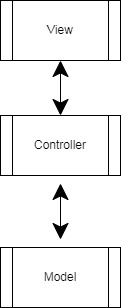

# Инструкция
## Описание
Программа предназначена для выполнения бинарных арифметических операций над рациональными и комплексными числами. Программа реализована в виде Telegram-бота работающего под именем <i>lesson10calcbot</i>
## Меню
* menu вывод текстового меню
* start вывод графического меню
* eval (expression) вычисляет результат арифметического выражения
* plog (print log) выводит историю выполненых операций вычисления
* clog (clear log) выполняет удаление истории

выбор требуемого действия осуществляется посредствам ввода /<пункт меню>

**Примеры**
* сложение рациональных чисел <i>/eval 2.1 + 2.4 = 4.5</i>
* сложение комплексных чисел <i>/eval 1+1i + 1+1i = 2.0 + 2.0 * i</i>
## Формат хранения данных
Программа сохраняет историю своей работы в текстовом файле <i>controller.log</i>
## Архитектура программы
Программа разработана по архитектуре MVC, в ее состав входят три основных модуля, взаимодействие между которыми показано на схеме:
* модель(Model.py)
* контроллер(Controller.py)
* представление(View.py)

Два дополнительных модуля отвечают за механизм реализации арифметических операций:
* над рациональными числами(Racl.py)
* над комплексными числами(Komp.py)
## Схема
